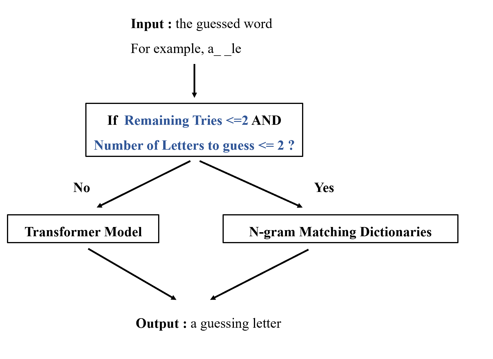
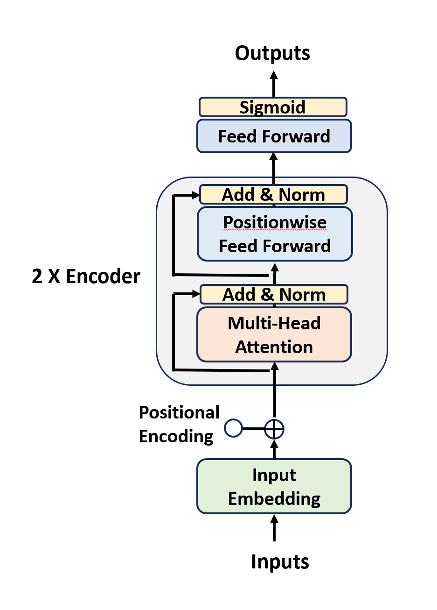

## My Hangman Report

Shihan Zhou,  2023/10/28

#### Main Strategy: Final Win Rate 59%

The main strategy for guessing a word can be divided into 2 parts: using a transformer model to return a guess, or using n-gram matching patterns to return a guess.

####  **Part 1: Transformer Model -- Multi-Label Classification Problem**

* **The model target:** for a input pattern like "res_roo_" , want to learn the labels ["t","m"] . (Making the word "restroom")

* <u>**Prepare the DataLoader**</u>

* **Step1:** I should **create instances** to learn from the given dictionaries

  *     Example: "apple"
        
        Inputs:       Outputs: (multi-label)
        "a____"        ["p","l","e"]
        "app__"        ["l", "e"]
        "_pple"        ["a"]
        "apple"        ["end"]

  * The problem can be seen as given a set of letters, return all the subsets of that set.

  *    Give a (random) non-empty subsets of a given set 

        If len(aset) <= 8, return all the subsets.
        Else, return a maximum of 256 subsets.
       
        Example: rd_subset(['e', 'i', 'a']) --> [['e', 'i', 'a'], ['e', 'a'], ['e', 'i'], ['a'], ['i'], ['e'], ['i', 'a']]

  * After first step, I have generated more than 35,000,000 instances from the dictionary

  * P.s. Due to the memory limit of my laptop, I split the instances into 2 part, and alternatively use them to train the model.

    

* **Step2:** create the dictionaries to transform the string input and outputs into Tensor

  * for example, appl_ --> ["e"]
  * padding and ending signal 
  * "appl_|____" --> [1,16,16,12, 0, 27, 0, 0, 0,...] (will latter be put into embedding layers )
  * ["e"] --> [0,0,0,0,0,1,0,0,...]

* <u>**Prepare the Model and Train the Model**</u>

* **Step3:**  Build a transformer model to learn the problem. 

  * Model structure:  Embedding + 2 encoder layer + FFN 

    ​	

  * Num of Params:  82,267

  * LossFucntion: BCEloss

* **Step4:**  Train the model

  * Alternatively use 2 parts of training data, schedule decreasing learning rate ,...
  * Problem here: 
    * I do not set aside some samples for validation to control the overfitting problem
    * 2 reasons here:
      * first, my DL model is really small, overfit problem may be less significant
      * while I am training the model, I also use the model to practice the hangman game, so practice itself can be seen as a control of training process

* **<u>Implement the model</u>**

* **Step5:** Return a guess using the model

  * Function:  `returnAGuess(candidates, guessed, mymodel)`

        # Function: Return a guess letter in the candidates based on the current word and the attention model
        
        candidates: list, like ["a","c","d","e","f"]
        guessed: str, like "_ppl_"
        mymodel: Mymodel, the trained model
        
        Return letters in the candidate list with the maximum logit returned by my transformer model

#### Part 2 :  N-gram Matching Dictionaries

* **How this work?**

  1. create n-gram dictionaries based on the original word dictionaries

     * for example, 3-gram, `split("apple",3) : ['app', 'ppl', 'ple']`
     * my n-gram dictionaries contain length from 3 to 7

  2.  The decision process:

     

* **Why use this methods?**

  * I find my transformer model has some difficulty in accurately predict the last 1 or 2 letters. 
    * It may quickly and accurately guess most of the letters but use up all the remaining tries guessing the last 1 or 2. 
    * May because my model is too small with too few number of parameters so it can only learn some general patterns with not so good ability in accurately predicting an etyma.
  * N-gram matching works well to predict the etyma with most of the letters already been shown. 

* Final win rate: 59%

  

